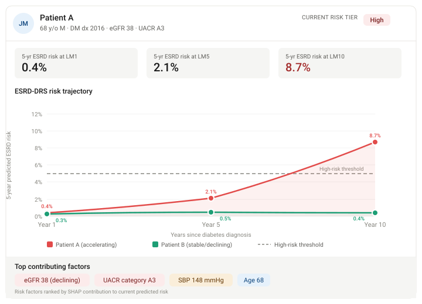

# End-Stage Renal Disease Dynamic Risk Score 
(ESRD-DRS)

## Dynamically Predicting ESRD After Development of Diabetes for Millions Across Biobanks

This repository contains the code for analyses in [manuscript name and link here].

-   Veterans Health Administration (VHA) data analysis in the `KDI` folder

    -   Shiny app to explore features extracted in the cohort in [`KDI/ShinyApp`](https://cpm-lab.shinyapps.io/VHAFeatureExtractionExplorer/)

-   NIH All of Us (AoU) data analysis in the `AOU` folder

## ESRD-DRS Clinical Dashboard Mockup

  

